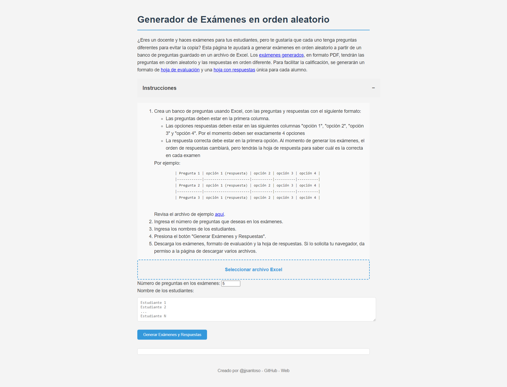

# Generador de exámenes en orden aleatorio

¿Eres un docente y haces exámenes para tus estudiantes, pero te gustaría que cada uno tenga preguntas diferentes para evitar la copia?
Esta página te ayudará a generar exámenes aleatorios a partir de un banco de preguntas guardado en un archivo de Excel.
Los [exámenes generados](example/examenes.pdf), en formato PDF, tendrán las preguntas en orden aleatorio y las respuestas en orden diferente.
Para facilitar la calificación, se generarán un formato de [hoja de evaluación](example/hoja_evaluacion.pdf) y una [hoja con respuestas](example/respuestas.pdf) única para cada alumno.

## Instrucciones

1. Crea un banco de preguntas usando Excel, con las preguntas y respuestas con el siguiente formato:

- Las preguntas deben estar en la primera columna.
- Las opciones respuestas deben estar en las siguientes columnas "opción 1", "opción 2", "opción 3" y "opción 4". Por el momento deben ser exactamente 4 opciones.
- La respuesta correcta debe estar en la primera opción. Al momento de generar los exámenes, el orden de respuestas cambiará, pero tendrás la hoja de respuesta para saber cuál es la correcta en cada examen.

  Por ejemplo:

  | Pregunta 1 | opción 1 (respuesta) | opción 2 | opción 3 | opción 4 |
  |------------|----------------------|----------|----------|----------|
  | Pregunta 2 | opción 1 (respuesta) | opción 2 | opción 3 | opción 4 |
  | Pregunta 3 | opción 1 (respuesta) | opción 2 | opción 3 | opción 4 |

    Revisa el archivo de ejemplo [aquí](example/preguntas_respuestas.xlsx).

2. Ingresa el número de preguntas que deseas en los exámenes.
3. Ingresa los nombres de los estudiantes.
4. Presiona el botón "Generar Exámenes y Respuestas".
5. Descarga los exámenes, formato de evaluación y la hoja de respuestas. Si lo solicita tu navegador, da permiso a la página de descargar varios archivos.

## Sitio renderizado

